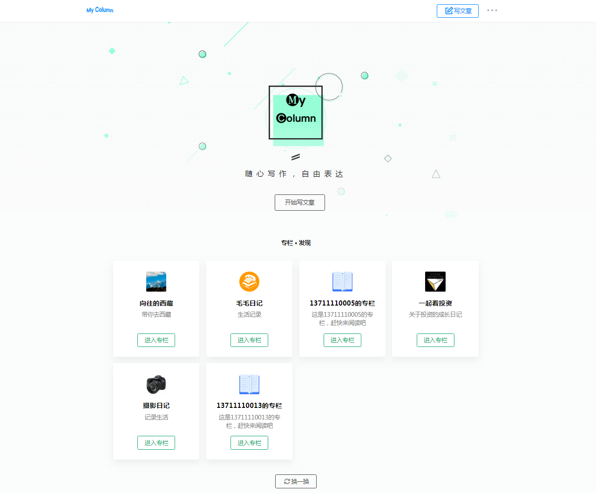
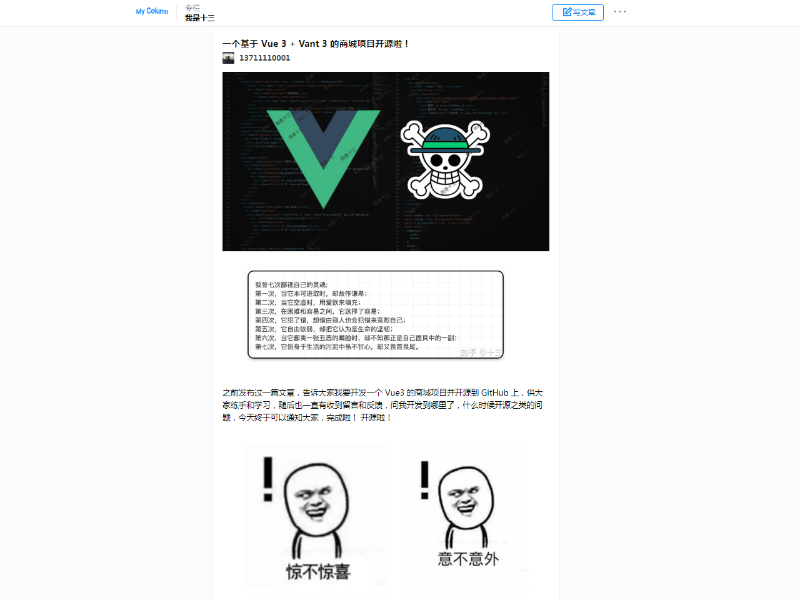

# My Column

**坚持不易，各位朋友如果觉得项目还不错的话可以给项目一个 star 吧，也是对我一直更新代码的一种鼓励啦，谢谢各位的支持。**

- **一个仿知乎专栏的 Spring Boot 实战项目；**
- **你也可以把它作为 Spring Boot 技术栈的学习项目，My Column 也足够符合要求，且代码和功能完备；**
- **技术栈新颖且知识点丰富，学习后可以提升大家对于知识的理解和掌握，对于提升你的市场竞争力有一定的帮助。**
- **My Column 还有一些不完善的地方，鄙人才疏学浅，望见谅；**
- **有任何问题都可以反馈给我，我会尽量完善该项目。**

> 更多 Spring Boot 实战项目可以关注十三的另一个代码仓库 [spring-boot-projects](https://github.com/ZHENFENG13/spring-boot-projects)，该仓库中主要是 Spring Boot 的入门学习教程以及一些常用的 Spring Boot 实战项目教程，包括 Spring Boot 使用的各种示例代码，同时也包括一些实战项目的项目源码和效果展示，实战项目包括基本的 web 开发以及目前大家普遍使用的前后端分离实践项目等，后续会根据大家的反馈继续增加一些实战项目源码，摆脱各种 hello world 入门案例的束缚，真正的掌握 Spring Boot 开发。

## 开发文档

### 《SpringBoot + Mybatis + Thymeleaf 专栏项目开发实战》(支付减免优惠券码 nZiF4DN9 )

- [**第01课：Spring Boot 项目开发环境**](https://www.shiyanlou.com/courses/3228)
- [第02课：快速构建 Spring Boot 应用](https://www.shiyanlou.com/courses/3228)
- [第03课：Spring Boot 项目开发之Web项目开发讲解](https://www.shiyanlou.com/courses/3228)
- [第04课：Spring Boot 整合 Thymeleaf 模板引擎](https://www.shiyanlou.com/courses/3228)
- [第05课：Thymeleaf 语法详解 语法详解](https://www.shiyanlou.com/courses/3228)
- [第06课：Spring Boot 自动配置数据源及操作数据库](https://www.shiyanlou.com/courses/3228)
- [第07课：Spring Boot 整合 MyBatis 操作数据库](https://www.shiyanlou.com/courses/3228)
- [第08课：Spring Boot 项目开发之验证码功能](https://www.shiyanlou.com/courses/3228)
- [第09课：项目开发之用户注册模块实现](https://www.shiyanlou.com/courses/3228)
- [第10课：项目开发之用户登录模块实现](https://www.shiyanlou.com/courses/3228)
- [第11课：项目开发之用户登录拦截器](https://www.shiyanlou.com/courses/3228)
- [第12课：项目实战之处理文件上传及路径回显](https://www.shiyanlou.com/courses/3228)
- [第13课：项目实战之个人中心页面制作](https://www.shiyanlou.com/courses/3228)
- [第14课：项目实战之专栏模块开发](https://www.shiyanlou.com/courses/3228)
- [第15课：富文本编辑器 wangEditor 整合](https://www.shiyanlou.com/courses/3228)
- [第16课：项目实战之文章发布功能开发](https://www.shiyanlou.com/courses/3228)
- [第17课：项目实战之文章列表及详情功能开发](https://www.shiyanlou.com/courses/3228)
- [第18课：项目实战之文章修改功能开发](https://www.shiyanlou.com/courses/3228)

## 联系作者

> 大家有任何问题或者建议都可以在 [issues](https://github.com/ZHENFENG13/My-Column/issues) 中反馈给我，我会慢慢完善这个项目。

- 我的邮箱：2449207463@qq.com
- QQ技术交流群：719099151 796794009

## 效果预览

- 首页

  

- 登录

  

- 专栏

  
  
- 个人中心

  

- 文章编辑

  

- 文章详情

  

## 感谢

- [spring-projects](https://github.com/spring-projects/spring-boot)
- [pandao](https://github.com/pandao/editor.md)
- [zhihu](https://www.zhihu.com/)